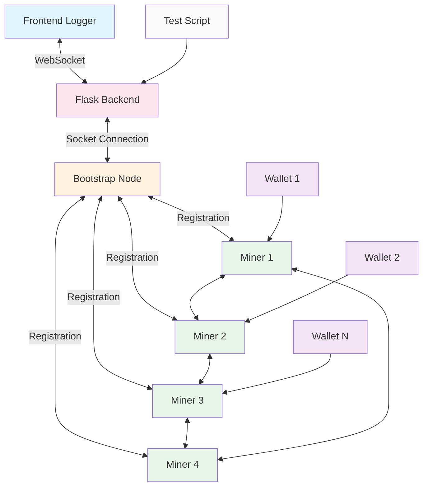
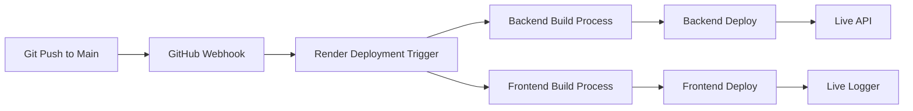

# Blockchain Network Simulator - Updated Features

A real-time blockchain network simulator that demonstrates core concepts of distributed ledger technology including mining, transaction processing, and peer-to-peer networking. This system visualizes how transactions flow through a blockchain network with multiple miners, wallets, and a bootstrap node.

## 🌐 Live Demo

- **Backend API**: [https://comp41770project-kartikeya-sharma.onrender.com/](https://comp41770project-kartikeya-sharma.onrender.com/)
- **Frontend Logger**: [https://comp41770project-kartikeya-sharma-1.onrender.com/](https://comp41770project-kartikeya-sharma-1.onrender.com/)

> **Deployment**: Automatic deployment occurs on every push to the main branch via Render.

## 🔄 System Architecture Flow Diagram

The system consists of several interconnected components:
1. **Frontend Logger**: Real-time visualization of blockchain events
2. **Backend API**: Flask server handling WebSocket communications
3. **Bootstrap Node**: Registration point for all miners in the network
4. **Miners**: Process transactions, mine blocks, and maintain the blockchain
5. **Wallets**: Generate and send transactions between participants
6. **Test Script**: Orchestrates the entire simulation process

## 🧱 Core Components & Functionality

### Transaction Model ([models/transaction.py](file:///Users/apple/Documents/ucd/blockchain/models/transaction.py))

Represents a financial transaction in the blockchain network.

- **[__init__()](file:///Users/apple/Documents/ucd/blockchain/models/Miner.py#L23-L45)**: Initializes a transaction with sender, receiver, fees, and amount
- **[tx_to_dict()](file:///Users/apple/Documents/ucd/blockchain/models/transaction.py#L39-L45)**: Serializes transaction to dictionary format
- **[from_dict()](file:///Users/apple/Documents/ucd/blockchain/models/block.py#L68-L76)**: Deserializes transaction from dictionary format
- Comparison operators: Enable priority queue sorting based on transaction fees

### Block Model ([models/block.py](file:///Users/apple/Documents/ucd/blockchain/models/block.py))

Represents a block in the blockchain containing multiple transactions.

- **[__init__()](file:///Users/apple/Documents/ucd/blockchain/models/Miner.py#L23-L45)**: Creates a block with transactions and previous block hash
- **[compute_hash()](file:///Users/apple/Documents/ucd/blockchain/models/block.py#L16-L25)**: Calculates SHA256 hash of the block contents
- **[build_merkle_root()](file:///Users/apple/Documents/ucd/blockchain/models/block.py#L27-L46)**: Constructs Merkle tree root from transactions
- **[mine_block()](file:///Users/apple/Documents/ucd/blockchain/models/block.py#L48-L55)**: Performs proof-of-work to find valid block hash
- **[to_dict()](file:///Users/apple/Documents/ucd/blockchain/models/block.py#L57-L65)** / **[from_dict()](file:///Users/apple/Documents/ucd/blockchain/models/block.py#L68-L76)**: Serialization/deserialization methods

### Wallet Model ([models/wallet.py](file:///Users/apple/Documents/ucd/blockchain/models/wallet.py))

Represents a participant in the blockchain network who can send/receive transactions.

- **[__init__()](file:///Users/apple/Documents/ucd/blockchain/models/Miner.py#L23-L45)**: Initializes a wallet with owner name and initial balance
- **[connect_to_bootstrap()](file:///Users/apple/Documents/ucd/blockchain/models/wallet.py#L14-L34)**: Establishes connection with bootstrap node to get miner list
- **[select_miner()](file:///Users/apple/Documents/ucd/blockchain/models/wallet.py#L36-L42)**: Randomly selects a miner for transaction processing
- **[connect_to_miner()](file:///Users/apple/Documents/ucd/blockchain/models/Miner.py#L191-L203)**: Establishes direct connection with a miner
- **[update_balance()](file:///Users/apple/Documents/ucd/blockchain/models/wallet.py#L57-L108)**: Queries miner for current wallet balance
- **[get_balance()](file:///Users/apple/Documents/ucd/blockchain/models/wallet.py#L110-L113)**: Returns current wallet balance
- **[send_transaction()](file:///Users/apple/Documents/ucd/blockchain/models/wallet.py#L115-L189)**: Sends transaction to another wallet through a miner

### Miner Model ([models/Miner.py](file:///Users/apple/Documents/ucd/blockchain/models/Miner.py))

Processes transactions, mines blocks, and maintains blockchain state.

#### Core Initialization Functions:
- **[__init__()](file:///Users/apple/Documents/ucd/blockchain/models/Miner.py#L23-L45)**: Initialize miner with network parameters and synchronization primitives
- **[start()](file:///Users/apple/Documents/ucd/blockchain/models/Miner.py#L47-L59)**: Starts miner services including server, connections, and mining threads
- **[sync_blockchain_on_startup()](file:///Users/apple/Documents/ucd/blockchain/models/Miner.py#L61-L71)**: Requests blockchain from peers when starting up

#### Connection Management:
- **[connect_to_peers()](file:///Users/apple/Documents/ucd/blockchain/models/Miner.py#L88-L108)**: Establishes connections with other miners in the network
- **[run_server()](file:///Users/apple/Documents/ucd/blockchain/models/Miner.py#L110-L123)**: Listens for incoming connections from wallets and miners
- **[handle_connection()](file:///Users/apple/Documents/ucd/blockchain/models/Miner.py#L125-L154)**: Identifies and routes incoming connections to appropriate handlers
- **[register_to_bootstrap()](file:///Users/apple/Documents/ucd/blockchain/models/Miner.py#L205-L232)**: Registers with bootstrap node to join network
- **[maintain_miner_connections()](file:///Users/apple/Documents/ucd/blockchain/models/Miner.py#L234-L251)**: Keeps connections with other miners updated
- **[connect_to_miner()](file:///Users/apple/Documents/ucd/blockchain/models/Miner.py#L253-L274)**: Establishes connection with a specific miner
- **[get_miners_from_bootstrap()](file:///Users/apple/Documents/ucd/blockchain/models/Miner.py#L276-L285)**: Retrieves current list of miners from bootstrap node

#### Communication Handlers:
- **[handle_client()](file:///Users/apple/Documents/ucd/blockchain/models/Miner.py#L156-L201)**: Handles communication with wallet clients
- **[handle_miner()](file:///Users/apple/Documents/ucd/blockchain/models/Miner.py#L287-L364)**: Handles communication with other miners

#### Transaction Management:
- **[add_transaction_to_mempool()](file:///Users/apple/Documents/ucd/blockchain/models/Miner.py#L366-L390)**: Adds new transaction to pending transactions pool
- **[is_transaction_in_chain()](file:///Users/apple/Documents/ucd/blockchain/models/Miner.py#L392-L405)**: Checks if transaction already exists in blockchain
- **[broadcast_transaction()](file:///Users/apple/Documents/ucd/blockchain/models/Miner.py#L407-L427)**: Shares transaction with all connected miners

#### Mining Functions:
- **[auto_mine()](file:///Users/apple/Documents/ucd/blockchain/models/Miner.py#L73-L86)**: Continuously attempts to mine blocks when enough transactions exist
- **[produce_block()](file:///Users/apple/Documents/ucd/blockchain/models/Miner.py#L429-L501)**: Mines a new block from transactions in mempool
- **[mine_block_with_cancel()](file:///Users/apple/Documents/ucd/blockchain/models/Miner.py#L503-L523)**: Mines block with ability to cancel mining process
- **[broadcast_block()](file:///Users/apple/Documents/ucd/blockchain/models/Miner.py#L570-L601)**: Shares newly mined block with all connected miners
- **[broadcast_block_dict()](file:///Users/apple/Documents/ucd/blockchain/models/Miner.py#L603-L632)**: Re-broadcasts received block to other miners

#### Blockchain Management:
- **[add_block_to_chain()](file:///Users/apple/Documents/ucd/blockchain/models/Miner.py#L525-L601)**: Adds a newly mined/received block to the blockchain with validation
- **[validate_chain()](file:///Users/apple/Documents/ucd/blockchain/models/Miner.py#L634-L662)**: Validates an entire blockchain for correctness
- **[replace_chain()](file:///Users/apple/Documents/ucd/blockchain/models/Miner.py#L664-L710)**: Replaces blockchain if new chain is longer and valid
- **[send_blockchain()](file:///Users/apple/Documents/ucd/blockchain/models/Miner.py#L712-L722)**: Sends blockchain to requesting peer
- **[request_chain_from_peer()](file:///Users/apple/Documents/ucd/blockchain/models/Miner.py#L724-L731)**: Requests blockchain from a peer

#### Balance Calculation:
- **[calculate_balance()](file:///Users/apple/Documents/ucd/blockchain/models/Miner.py#L733-L751)**: Computes wallet balance based on blockchain state and mempool

#### System Shutdown:
- **[stop()](file:///Users/apple/Documents/ucd/blockchain/models/Miner.py#L753-L776)**: Gracefully shuts down the miner

### Bootstrap Node ([models/bootstrapNode.py](file:///Users/apple/Documents/ucd/blockchain/models/bootstrapNode.py))

Central registry for all miners in the network.

- **[__init__()](file:///Users/apple/Documents/ucd/blockchain/models/Miner.py#L23-L45)**: Initializes bootstrap node with host/port
- **[start()](file:///Users/apple/Documents/ucd/blockchain/models/Miner.py#L47-L59)**: Starts listening for miner registrations
- **[handle_client()](file:///Users/apple/Documents/ucd/blockchain/models/Miner.py#L156-L201)**: Processes registration and miner list requests
- **[receive_json_line()](file:///Users/apple/Documents/ucd/blockchain/models/bootstrapNode.py#L68-L81)** / **[send_json_line()](file:///Users/apple/Documents/ucd/blockchain/models/bootstrapNode.py#L83-L88)**: JSON communication helpers

### Test Script ([test_script_v2.py](file:///Users/apple/Documents/ucd/blockchain/test_script_v2.py))

Orchestrates the entire blockchain simulation process.

- **[check_stop()](file:///Users/apple/Documents/ucd/blockchain/test_script_v2.py#L22-L25)**: Checks if stop signal has been received and raises exception if so
- **[start_bootstrap()](file:///Users/apple/Documents/ucd/blockchain/test_script_v2.py#L28-L34)**: Initializes and starts bootstrap node
- **[start_miners()](file:///Users/apple/Documents/ucd/blockchain/test_script_v2.py#L37-L54)**: Creates and starts multiple miners
- **[setup_wallets()](file:///Users/apple/Documents/ucd/blockchain/test_script_v2.py#L57-L69)**: Creates wallets and connects them to the network
- **[simulate_transactions()](file:///Users/apple/Documents/ucd/blockchain/test_script_v2.py#L72-L97)**: Generates transactions between wallets
- **[print_mempools()](file:///Users/apple/Documents/ucd/blockchain/test_script_v2.py#L100-L106)**: Displays current transaction pools of all miners
- **[print_blockchains()](file:///Users/apple/Documents/ucd/blockchain/test_script_v2.py#L109-L114)**: Shows current state of all miner blockchains
- **[mine_block()](file:///Users/apple/Documents/ucd/blockchain/test_script_v2.py#L117-L136)**: Triggers manual block mining process
- **[update_wallet_balances()](file:///Users/apple/Documents/ucd/blockchain/test_script_v2.py#L139-L149)**: Updates and displays final wallet balances
- **[shutdown()](file:///Users/apple/Documents/ucd/blockchain/test_script_v2.py#L152-L167)**: Gracefully stops all components
- **[test_blockchain()](file:///Users/apple/Documents/ucd/blockchain/test_script_v2.py#L170-L210)**: Main orchestrator function that runs the full simulation
- **[stop_test()](file:///Users/apple/Documents/ucd/blockchain/test_script_v2.py#L214-L217)**: Stops ongoing test execution

## 🖥️ Frontend Logger (`blockchain-logger/`)

### BlockchainLogger Component ([BlockChainLogger.jsx](file:///Users/apple/Documents/ucd/blockchain/blockchain-logger/src/BlockChainLogger.jsx))

Real-time visualization dashboard for blockchain events.

- **State Management**: Manages logs, connection status, and test execution state
- **WebSocket Integration**: Connects to backend via Socket.IO for real-time updates
- **Log Filtering**: Separates logs by component type (bootstrap, miners, wallets, etc.)
- **Interactive UI**: Allows viewing individual log entries and full log sections
- **Test Controls**: Provides buttons to start/stop tests and clear logs

#### Key Functions:

- **`useEffect()`** hooks: Handle WebSocket connection lifecycle
- **`startTest()`**: Initiates blockchain simulation
- **`clearLogs()`**: Clears displayed logs
- **[LogSection](file:///Users/apple/Documents/ucd/blockchain/blockchain-logger/src/BlockChainLogger.jsx#L89-L153)**: Component for displaying categorized logs
- **[SectionModal](file:///Users/apple/Documents/ucd/blockchain/blockchain-logger/src/BlockChainLogger.jsx#L57-L87)**: Modal for viewing complete log sections
- Auto-scroll functionality: Keeps logs visible as they arrive

### Log Categories Displayed:
1. **Bootstrap Node**: Registration and coordination messages
2. **Miners**: Mining activities, block creation, and peer communications
3. **Wallets**: Transaction initiation and balance queries
4. **Test Logs**: Progress indicators and orchestration messages
5. **Errors**: Any system errors or exceptions

## ⚙️ Backend API ([api/index.py](file:///Users/apple/Documents/ucd/blockchain/api/index.py))

Central Flask server handling WebSocket communications and test orchestration.

### WebSocketLogger Class

Intercepts standard output and broadcasts log messages to connected clients.

- **[__init__()](file:///Users/apple/Documents/ucd/blockchain/models/Miner.py#L23-L45)**: Initializes logger with reference to original stdout
- **[write()](file:///Users/apple/Documents/ucd/blockchain/api/index.py#L22-L32)**: Captures print statements and emits them via WebSocket
- **[flush()](file:///Users/apple/Documents/ucd/blockchain/api/index.py#L34-L35)**: Ensures immediate delivery of log messages
- **[close()](file:///Users/apple/Documents/ucd/blockchain/api/index.py#L37-L38)**: Restores normal stdout behavior

### API Endpoints:
- **[home()](file:///Users/apple/Documents/ucd/blockchain/api/index.py#L56-L57)**: Health check endpoint returning simple confirmation
- **[health()](file:///Users/apple/Documents/ucd/blockchain/api/index.py#L110-L111)**: Status endpoint indicating server is operational

### WebSocket Event Handlers:
- **[handle_connect()](file:///Users/apple/Documents/ucd/blockchain/api/index.py#L60-L62)**: Manages new client connections
- **[handle_disconnect()](file:///Users/apple/Documents/ucd/blockchain/api/index.py#L65-L66)**: Handles client disconnections
- **[handle_start_test()](file:///Users/apple/Documents/ucd/blockchain/api/index.py#L69-L90)**: Initiates blockchain simulation
- **[handle_stop_test()](file:///Users/apple/Documents/ucd/blockchain/api/index.py#L93-L107)**: Stops ongoing blockchain simulation
- **[start_logging()](file:///Users/apple/Documents/ucd/blockchain/api/index.py#L42-L47)**: Starts capturing print statements for broadcasting
- **[stop_logging()](file:///Users/apple/Documents/ucd/blockchain/api/index.py#L49-L53)**: Stops logging and restores stdout

## 🛠️ Constants ([utils/constants.py](file:///Users/apple/Documents/ucd/blockchain/utils/constants.py))

Configuration values used throughout the system:
- **[TRANS_PER_BLOCK](file:///Users/apple/Documents/ucd/blockchain/utils/constants.py#L0-L0)**: Number of transactions per block (4)
- **[QUEUED_CONNECTION](file:///Users/apple/Documents/ucd/blockchain/utils/constants.py#L1-L1)**: Maximum queued connections (10)
- **[MINER_PORT](file:///Users/apple/Documents/ucd/blockchain/utils/constants.py#L2-L2)**: List of ports for miner instances ([6001, 6002, 6003, 6004])
- **[MINING_DIFFICULTY](file:///Users/apple/Documents/ucd/blockchain/utils/constants.py#L3-L3)**: Proof-of-work difficulty level (2 leading zeros)

## 🚀 Development & Deployment Workflow

### Continuous Deployment Process

1. Developer pushes code changes to main branch
2. GitHub notifies Render via webhook
3. Render simultaneously builds backend and frontend applications
4. Applications are deployed to production servers
5. Services become accessible via provided URLs

### Local Development Setup
1. Clone the repository
2. Install Python dependencies: `pip install -r requirements.txt`
3. Install frontend dependencies: `cd blockchain-logger && npm install`
4. Run backend server: `python api/index.py`
5. Run frontend: `cd blockchain-logger && npm start`
6. Access logger at http://localhost:3000

## 📊 System Features

### Real-time Monitoring
- Live log streaming from all blockchain components
- Interactive log inspection capabilities

### Blockchain Simulation
- Complete blockchain network with multiple miners
- Transaction generation and propagation
- Proof-of-work mining demonstration
- Wallet balance management

### Network Visualization
- Peer-to-peer miner connections
- Transaction flow tracking
- Block propagation monitoring

### Educational Value
- Demonstrates core blockchain concepts
- Shows distributed consensus mechanisms
- Illustrates network communication patterns
- Provides insight into mining process

This comprehensive system provides a hands-on demonstration of how blockchain networks operate, with real-time visibility into the various processes that occur behind the scenes.