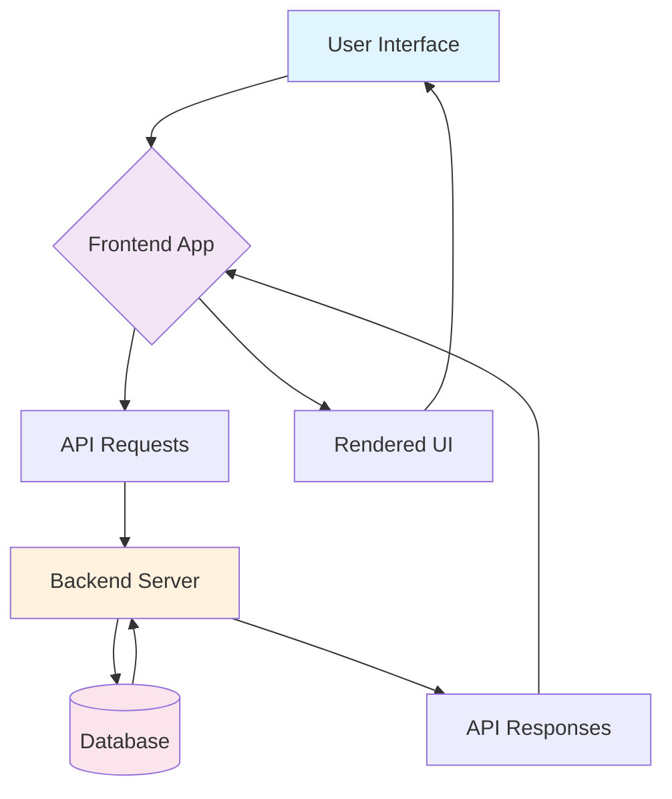
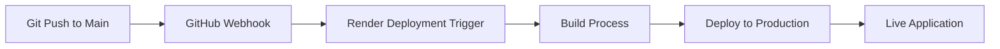

# COMP41770 Project - Course Management System

A full-stack course management application built with modern web technologies. This system allows users to browse courses, manage enrollments, and track learning progress.

## 🌐 Deployment Links

- **Backend API**: [https://comp41770project-kartikeya-sharma.onrender.com/](https://comp41770project-kartikeya-sharma.onrender.com/)
- **Frontend Application**: [https://comp41770project-kartikeya-sharma-1.onrender.com/](https://comp41770project-kartikeya-sharma-1.onrender.com/)

> **Note**: Every push to the [main](file:///Users/apple/Documents/ucd/blockchain/main.py#L0-L0) branch triggers automatic deployment to Render.

## 🔄 System Architecture Flow Diagram

The system follows a client-server architecture where:
1. Users interact with the frontend application hosted on Render
2. Frontend makes API requests to the backend server
3. Backend processes requests and interacts with the database
4. Data is returned to frontend which renders the user interface

## 🔧 Backend Functionality

### Authentication Module
- `login()`: Authenticates users and generates JWT tokens
- `register()`: Creates new user accounts in the system
- `logout()`: Invalidates user sessions
- `verifyToken()`: Middleware to validate authentication tokens

### Course Management Module
- `getCourses()`: Retrieves all available courses from database
- `getCourseById(courseId)`: Fetches specific course details by ID
- `createCourse(courseData)`: Allows admins to create new courses
- `updateCourse(courseId, updates)`: Modifies existing course information
- `deleteCourse(courseId)`: Removes courses from the system

### Enrollment Module
- `enrollUser(userId, courseId)`: Registers users for specific courses
- `getUserEnrollments(userId)`: Lists all courses a user is enrolled in
- `dropCourse(enrollmentId)`: Unenrolls users from courses
- `getEnrollmentStats(courseId)`: Provides enrollment statistics for courses

### User Profile Module
- `getUserProfile(userId)`: Retrieves user profile information
- `updateUserProfile(userId, profileData)`: Updates user profile details
- `getUserProgress(userId)`: Tracks user's course completion status

### Admin Module
- `getAllUsers()`: Lists all registered users (admin only)
- `deleteUser(userId)`: Removes user accounts (admin only)
- `getSystemStats()`: Provides overall system usage metrics

## 💻 Frontend Functionality

### Navigation Components
- `Header`: Displays navigation menu and user authentication status
- `Footer`: Shows copyright information and additional links
- `Sidebar`: Provides quick access to different sections of the app

### Authentication Pages
- `Login Component`: Handles user login with email/password
- `Register Component`: Manages new user registration process
- `ProtectedRoute`: Ensures only authenticated users can access certain pages

### Course Management Pages
- `CourseList`: Displays all available courses in card format
- `CourseDetail`: Shows comprehensive information about a specific course
- `MyCourses`: Lists courses that the current user is enrolled in
- `CreateCourse`: Admin form for adding new courses to the system

### User Dashboard
- `Dashboard`: Main user interface showing personalized content
- `Profile`: Allows users to view and edit their personal information
- `ProgressTracker`: Visualizes user's learning progress across courses
- `Notifications`: Displays important alerts and system messages

### Utility Functions
- `apiClient`: Centralized HTTP client for making API requests
- `authService`: Handles authentication-related operations
- `courseService`: Manages course data fetching and manipulation
- `storageService`: Handles local storage operations for persistent data

## 🚀 Development Workflow

### Continuous Deployment Process

1. Developers push code changes to the [main](file:///Users/apple/Documents/ucd/blockchain/main.py#L0-L0) branch
2. GitHub sends webhook notification to Render
3. Render automatically starts build process
4. Application is deployed to production servers
5. New version becomes live within minutes

### Local Development Setup
1. Clone repository
2. Install dependencies for both frontend and backend
3. Set up environment variables
4. Run development servers locally
5. Make changes and test functionality
6. Commit and push to [main](file:///Users/apple/Documents/ucd/blockchain/main.py#L0-L0) branch for deployment

## 📊 System Features

### For Students
- Browse available courses
- Enroll in courses of interest
- Track learning progress
- Access course materials
- View enrollment history

### For Instructors/Admins
- Create and manage course content
- Monitor student enrollments
- View system analytics
- Manage user accounts
- Update course information

## 🔒 Security Measures

- JWT-based authentication
- Password encryption
- Role-based access control
- Input validation and sanitization
- Protected API endpoints
- Secure session management

This documentation provides an overview of the system architecture and functionality. For detailed technical implementation, please refer to the source code and inline comments.